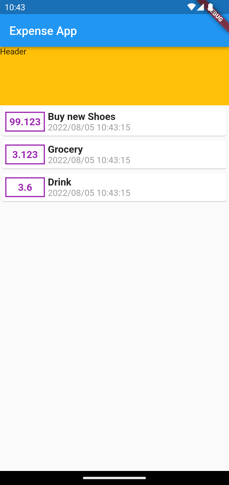
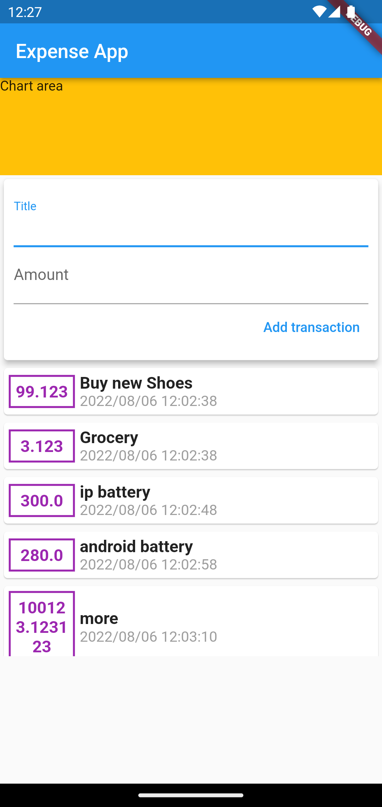
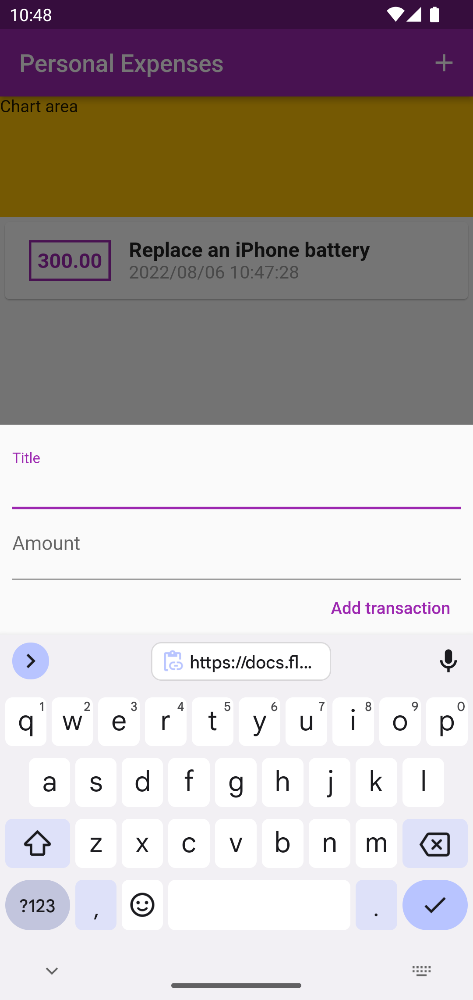
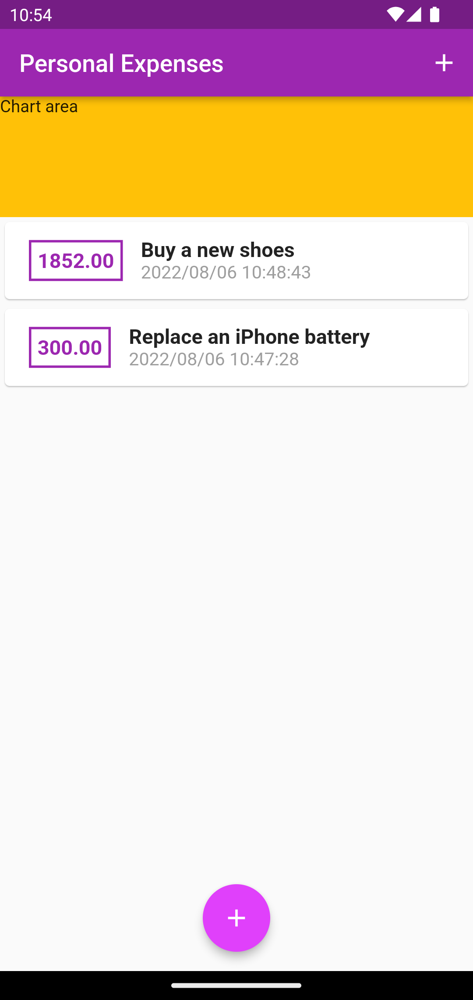

# Learn Flutter

I'm acquiring Flutter and Dart skill

## How

I spent at least 1 hour per day to learn and practice Flutter & Dart

I will push one commit after that with a short description of what I have acquired

## Note

I already done learning Dart from [Dart Language Tour](https://dart.dev/guides/language/language-tour)

## Why would I publicize this repo?

I want to push myself to acquire a new skill.

## Day 03

No coding today, just learn about running app on differents platform, emulator, simulator, real devices, debugging tools, Flutter Dev tools, how to profile app an so on.

## Day 04

* Combine Container, Row, Column, Card
* Model Class

## Day 05

* split widgets, models
* ListView, TextField, TextEditingController, InputDecoration

## Day 06

* Refactor UI
* Showing/poping modal
* ThemeData
* keyboardType, AppBar actions
* FloatingActionButton

